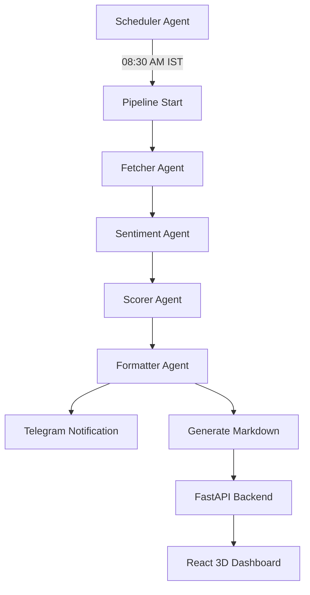

# 🚀 Stock & Crypto Morning Brief System

An AI-powered multi-agent pipeline that fetches live market data, analyzes sentiment, scores assets, and delivers a clean intelligence brief every morning before markets open.


-orange)


---

## 🏛️ Project Architecture

The system uses a **hub-and-spoke orchestration model**. A central scheduler container runs 24/7, triggering a sequential pipeline of specialized agents every morning at **08:30 AM IST**.



### 1. The Agent Pipeline (Sequential)
- **Agent 1: Fetcher** → Pulls live prices and news headlines using `yfinance` and `CoinGecko`.
- **Agent 2: Sentiment** → Groq-powered LLM analysis of market mood per ticker.
- **Agent 3: Scorer** → Ranks assets based on sentiment scores, momentum, and volume.
- **Agent 4: Formatter** → Compiles the final Markdown brief and delivers it via Telegram.

### 2. The Orchestrator (Scheduler)
A dedicated 24/7 Python service using `APScheduler`. It communicates directly with the host's Docker engine via the **Docker Socket** (`/var/run/docker.sock`) to spin up and manage agent containers on demand.

### 3. Backend & Frontend
- **Backend**: FastAPI serving processed market data and historical morning briefs.
- **Frontend**: A premium React dashboard featuring **Three.js** 3D visualizations and smooth **GSAP** animations for an immersive market overview.

---

## 🛠️ Setup & Installation

### Prerequisites
- **Docker & Docker Compose** (Required)
- **Groq API Key** (For LLM sentiment analysis)
- **Telegram Bot Token** (For automated brief delivery)

### 1. Environment Configuration
Create a `.env` file in the root directory (referencing `.env.example` if available):
```bash
GROQ_API_KEY=your_groq_key
TELEGRAM_BOT_TOKEN=your_bot_token
TELEGRAM_CHAT_ID=your_chat_id
```

### 2. Running with Docker (Recommended)
The project uses Docker **Profiles** to manage the lifecycle of different components.

**Start the 24/7 Services (Scheduler & Backend):**
```bash
docker compose up -d
```

**Manually Trigger the Pipeline (For Testing):**
```bash
docker compose --profile pipeline run --rm fetcher sentiment scorer formatter
```
*Note: The scheduler service will automatically handle this every morning.*

---

## 📁 Directory Structure

```text
.
├── agents/              # Specialized AI Agents
│   ├── scheduler/       # 24/7 Orchestrator (triggers the daily pipeline)
│   ├── fetcher/         # Data ingestion (Prices, News)
│   ├── sentiment/       # LLM Sentiment analysis
│   ├── scorer/          # Quantitative asset scoring
│   └── formatter/       # Brief generation & Telegram delivery
├── backend/             # FastAPI Backend API
├── frontend/            # React + Vite + Three.js Dashboard
├── data/                # Persistent JSON data stores
├── output/              # Generated Markdown morning briefs
└── docker-compose.yml   # Multi-container orchestration
```

---

## 📊 Automation & Notifications
The scheduler provides real-time updates via Telegram:
- 🚀 **Start**: Notifies when the morning pipeline begins.
- ✅ **Success**: Confirms when the brief is ready and provides a completion time.
- ❌ **Failure**: Alerts if any agent fails, including logs for debugging.

To adjust the run time or timezone, modify the configuration in `agents/scheduler/app.py`.

---
_Generated by Stock Morning Brief Agent_
